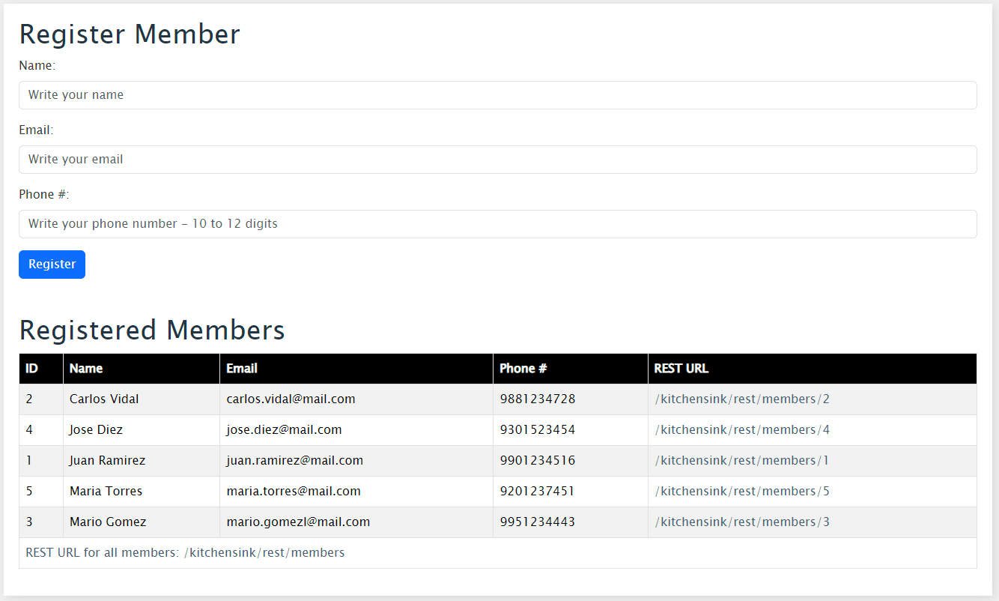

# KitchenSink Application Migration

This repository contains the migrated KitchenSink application from a Jakarta EE 10 compliant application to a Spring Boot application leveraging a hexagonal architecture and MongoDB.

## Migration Overview

The KitchenSink application has been built using several Jakarta EE technologies, including JSF, CDI, JAX-RS, EJB, JPA, and Bean Validation. This document outlines the migration process, including the technologies used, architecture changes, and deployment strategies.

### 1. Application Analysis

- **JSF to Thymeleaf**: Migrated the frontend from JSF to Thymeleaf, allowing dynamic template creation and flexibility within the Spring ecosystem.
- **CDI to Spring Framework**: Utilized Spring's dependency injection features with annotations like `@Component`, `@Service`, `@Repository`, and `@Autowired`.
- **JAX-RS to Spring Web**: Replaced JAX-RS RESTful services with Spring's `@RestController` and `@RequestMapping`.
- **EJB to Spring Services**: Refactored EJBs into Spring services, utilizing `@Service` and `@Transactional` for business logic.
- **JPA to Spring Data MongoDB**: Maintained data persistence using Spring Data MongoDB for seamless integration with MongoDB.
- **Bean Validation**: Continued using validation annotations like `@NotNull`, `@Size`, etc., as Spring Boot natively supports these.

### 2. Recommended Technologies

- **Frontend**: Thymeleaf was chosen for its seamless integration with Spring Boot and support for internationalization.
- **_Optional_**: _For a separate frontend approach, frameworks like React or Angular could be considered, but Thymeleaf offers a unified migration path._

### 3. Migration Plan

#### Step 1: Create Spring Boot Project
- Initialize a new Spring Boot project using [Spring Initializr](https://start.spring.io/).
    - Java 21
    - Dependencies:
        - Spring Web
        - Thymeleaf
        - Spring Data MongoDB
        - Spring Boot DevTools
        - Validation
        - Actuator

#### Step 2: Migrate JSF to Thymeleaf
- Convert JSF views (XHTML) to Thymeleaf templates (HTML).
- Ensure existing internationalization support is maintained using Thymeleaf's message files.

#### Step 3: Migrate CDI and EJB
- Replace CDI annotations (`@Inject`, `@Named`, `@Produces`) with Spring annotations (`@Autowired`, `@Service`, `@Component`).
- Convert EJBs to Spring services.

#### Step 4: Migrate JAX-RS to Spring MVC
- Transition JAX-RS endpoints to Spring controllers with `@RestController` and `@RequestMapping`.

#### Step 5: Migrate JPA and Validation
- Ensure JPA entities and repositories are correctly configured with Spring Data MongoDB.
- Maintain Bean Validation annotations for data integrity.

#### Step 6: MongoDB Configuration (Stretch Goal)
- If adopting MongoDB, replace Spring Data JPA with Spring Data MongoDB.
    - Set up MongoDB access and adjust classes interacting with the database.
    - Transform JPA entities to MongoDB documents using `@Document`.

### 4. Create GitHub Repository
- GitHub repository for the migrated project is: https://github.com/yvan-lopez-it/kitchensink-challenge
- Document the cloning, building, and running processes in the `README.md`.

### 5. Deployment Strategies

- **Local Deployment**: Use `mvn clean install` or `mvn clean package` then `mvn spring-boot:run` to run the application locally.
- **Cloud Deployment**: Consider using AWS services like Elastic Beanstalk or Docker containers on AWS ECS.

### 6. Task Structuring
For larger projects, structure the tasks as follows:
1. **Base Infrastructure Migration (Spring Boot Setup)**
2. **Component Migration (Frontend, Business Logic, Persistence)**
3. **Unit and Integration Testing**
4. **Refactoring and Optimization**
5. **Functional Testing**
6. **Documentation and Deployment**

### 7. Dockerization

- **Create Dockerfile**:
  Write a `Dockerfile` to package the Spring Boot application.

- **Build the Docker Image**: Use Docker commands to build the image. I.e.: `docker build -t kitchensink .`

### 8. GitHub Actions Automation
After pushing the project to GitHub, it is recommended to automate the build and deployment process using GitHub Actions.

1. **GitHub Actions workflow that automates**:

   - The build and creation of the Docker image.
   - The upload of the image to DockerHub.
   - The deployment of the Docker image to AWS ECS.

2. **DockerHub and AWS ECS**:
   - The  workflow builds the Docker image, pushes it to DockerHub, and then deploys the image to an existing AWS ECS cluster.
   - Use GitHub Secrets for DOCKER_USERNAME, DOCKER_PASSWORD, and AWS credentials to authenticate the process.

### 9. Deployment to AWS ECS
- **Setup AWS ECS**:
   - Create a ECS cluster on AWS.
   - Configure task definitions and services to run the Docker container.
   - Ensure proper security groups, load balancer (if needed), and auto-scaling configurations.
- **Application Accessibility**:
   - Expose the application using an Application Load Balancer (ALB) for internet access.

